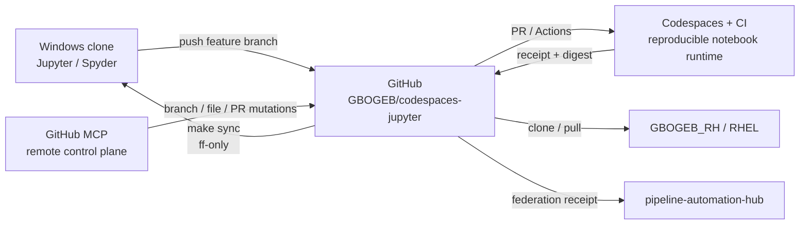

# GitHub-first Jupyter / Spyder / MCP workflow

## Operating rule

GitHub is the intermediate synchronization surface. A local Windows clone,
Codespaces/Jupyter, Spyder, Red Hat, and MCP-driven remote mutations all meet at
the repository boundary; they do not share a mutable local working directory.



## Human status legend

| State | Meaning | Human action |
|---|---|---|
| 🟢 GREEN | clean, exact, reproducible | continue |
| 🟡 YELLOW | clean but behind / pending proof | inspect then continue |
| 🔴 RED | dirty, diverged, failed proof | stop mutation; repair first |

## First clone

```bash
git clone https://github.com/GBOGEB/codespaces-jupyter.git
cd codespaces-jupyter
git switch -c work/<topic>
make scoopo
make probe
```

On Windows, run the same commands from PowerShell with Git and GNU Make
available, or invoke the Python scripts directly.

## Reload after a remote MCP or GitHub task

Do not overwrite or merge a dirty local tree.

```bash
git status
make sync
```

`make sync` fetches `origin/main`, refuses dirty/diverged/ahead states, and only
permits a fast-forward. If local work exists, commit it to a feature branch and
push it before refreshing main.

## Jupyter

Start from the repository root so relative paths remain stable:

```bash
make jupyter
```

The governed smoke path is:

```bash
make probe
```

It executes `notebooks/runtime_probe.ipynb` twice and emits:
`artifacts/runtime_probe/receipt.json`, two executed notebooks, and
`HUMAN_REVIEW.md`.

## Spyder

Install `requirements-ide.txt`, then point Spyder at the same Python
environment used by the clone. The file installs `spyder-kernels` but does not
force a separate Spyder installation. On Windows it also installs
`pythonnet` for optional .NET interoperability.

## MCP boundary

The GitHub MCP surface is a remote repository-control plane. Use it for exact
branch/file/PR mutations, then refresh the local clone through the guarded
fast-forward flow. Never infer that an MCP write also changed the workstation
filesystem.

Current MCP authority reference: `GBOGEB/github-mcp-server`. No engineering
authority is transferred by repository mutation or notebook execution.

## GBOGEB_RH / Red Hat

RHEL uses the same Git boundary:

```bash
git clone https://github.com/GBOGEB/codespaces-jupyter.git
cd codespaces-jupyter
make runtime
make probe
```

No Windows or OneDrive absolute path is part of the governed runtime contract.
