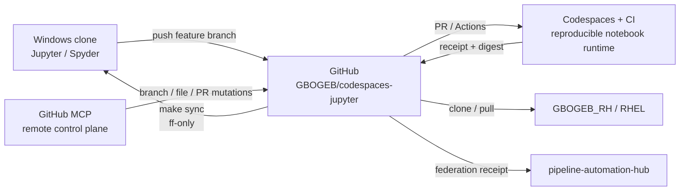

# W286 recursive recreation patch

Apply these file bodies to a clone of `GBOGEB/codespaces-jupyter` at or after base `1eba2240a86d1fd2bd6375e2fac481caf645cdde`.

----FILE: README.md
# GBOGEB Codespaces Jupyter Runtime

Governed reproducible notebook runtime for the GBOGEB federation.

This repository is GitHub-backed and is intended to be the shared runtime
boundary between local Jupyter/Spyder work, Codespaces, GitHub Actions, MCP
repository mutation, and Red Hat execution. Local machines do **not** share a
working directory with MCP or CI; GitHub is the synchronization intermediate.

## Quick start

```bash
git clone https://github.com/GBOGEB/codespaces-jupyter.git
cd codespaces-jupyter
make scoopo
make probe
```

For a conda-first environment:

```bash
make coco
```

Start JupyterLab from the repository root:

```bash
make jupyter
```

## Refresh after remote GitHub/MCP work

```bash
git switch main
make sync
```

The sync guard refuses dirty, diverged, or locally-ahead states and only
fast-forwards a clean clone from `origin/main`.

## Governed runtime proof

`make probe` executes `notebooks/runtime_probe.ipynb` twice. Success requires:

- more than zero executed code cells on both runs;
- identical canonical output digests;
- an exact repository source SHA;
- a human-readable RYG review receipt.

Outputs are written below `artifacts/runtime_probe/`. GitHub Actions runs the
same probe on relevant pull requests.

## IDE and MCP integration

See `docs/GITHUB_FIRST_IDE_MCP_WORKFLOW.md` for Jupyter, Spyder, GitHub MCP,
local Git and GBOGEB_RH / RHEL operating rules.

## Authority guard

Notebook execution and repository mutation are runtime/tooling evidence only.
They do not confer engineering or domain-validation authority.

----END FILE: README.md

----FILE: requirements.txt
ipywidgets==8.1.2
ipykernel>=6,<7
nbclient>=0.10,<1
nbformat>=5,<6
matplotlib==3.8.4
pandas==2.2.2
torch==2.7.1
torchvision==0.21.0
tqdm==4.66.4

----END FILE: requirements.txt

----FILE: requirements-ide.txt
-r requirements.txt
jupyterlab>=4,<5
nbconvert>=7,<8
spyder-kernels>=3,<4
pythonnet>=3,<4; platform_system=="Windows"

----END FILE: requirements-ide.txt

----FILE: environment.yml
name: gbogeb-jupyter
channels:
  - conda-forge
dependencies:
  - python=3.11
  - pip

----END FILE: environment.yml

----FILE: Makefile
PYTHON ?= python
ENV_NAME ?= gbogeb-jupyter
PROBE_NOTEBOOK ?= notebooks/runtime_probe.ipynb
PROBE_OUT ?= artifacts/runtime_probe

.PHONY: runtime scoopo coco sync doctor probe report jupyter smoke clean-probe

runtime:
	$(PYTHON) -m pip install -r requirements.txt

scoopo:
	$(PYTHON) -m pip install --upgrade pip
	$(PYTHON) -m pip install -r requirements-ide.txt

coco:
	conda env create -f environment.yml || conda env update -n $(ENV_NAME) -f environment.yml
	conda run -n $(ENV_NAME) python -m pip install -r requirements-ide.txt

sync:
	$(PYTHON) scripts/git_sync_guard.py --pull

doctor:
	$(PYTHON) scripts/git_sync_guard.py

probe:
	$(PYTHON) scripts/runtime_probe.py --notebook $(PROBE_NOTEBOOK) --output-dir $(PROBE_OUT)

report: probe
	@echo "Open $(PROBE_OUT)/HUMAN_REVIEW.md and $(PROBE_OUT)/receipt.json"

jupyter:
	$(PYTHON) -m jupyterlab .

smoke:
	$(PYTHON) -m compileall -q scripts
	$(PYTHON) scripts/git_sync_guard.py
	$(PYTHON) scripts/runtime_probe.py --notebook $(PROBE_NOTEBOOK) --output-dir $(PROBE_OUT)

clean-probe:
	$(PYTHON) -c "import shutil; shutil.rmtree('$(PROBE_OUT)', ignore_errors=True)"

----END FILE: Makefile

----FILE: scripts/git_sync_guard.py
#!/usr/bin/env python3
"""Fail-closed GitHub-first sync helper.

The helper never merges a dirty or diverged local tree. It is intended for the
local Jupyter/Spyder workflow where GitHub is the intermediate synchronization
surface between remote tasks and the workstation clone.
"""
from __future__ import annotations

import argparse
import json
import subprocess
import sys
from pathlib import Path


def run(*args: str, check: bool = True) -> subprocess.CompletedProcess[str]:
    return subprocess.run(
        ["git", *args],
        check=check,
        text=True,
        capture_output=True,
    )


def main() -> int:
    parser = argparse.ArgumentParser()
    parser.add_argument("--pull", action="store_true", help="fast-forward from origin/main when safe")
    args = parser.parse_args()

    try:
        root = Path(run("rev-parse", "--show-toplevel").stdout.strip())
    except subprocess.CalledProcessError:
        print("RED: not inside a Git repository", file=sys.stderr)
        return 2

    dirty = run("status", "--porcelain").stdout.splitlines()
    receipt = {
        "schema": "gbogeb.git_sync_guard/v1",
        "repo_root": str(root),
        "dirty": bool(dirty),
        "dirty_entries": dirty,
        "pull_requested": args.pull,
    }
    if dirty:
        receipt["status"] = "RED_DIRTY_TREE"
        print(json.dumps(receipt, indent=2))
        return 2

    remote = run("remote", "get-url", "origin", check=False)
    if remote.returncode != 0:
        receipt["status"] = "RED_NO_ORIGIN"
        print(json.dumps(receipt, indent=2))
        return 2

    receipt["origin"] = remote.stdout.strip()
    run("fetch", "--prune", "origin", "main")
    counts = run("rev-list", "--left-right", "--count", "HEAD...origin/main").stdout.strip().split()
    ahead, behind = map(int, counts)
    receipt.update({"ahead": ahead, "behind": behind})

    if ahead and behind:
        receipt["status"] = "RED_DIVERGED"
        print(json.dumps(receipt, indent=2))
        return 3

    if ahead:
        receipt["status"] = "YELLOW_LOCAL_COMMITS_NOT_ON_MAIN"
        print(json.dumps(receipt, indent=2))
        return 3

    if args.pull and behind:
        run("pull", "--ff-only", "origin", "main")
        receipt["status"] = "GREEN_FAST_FORWARDED"
    elif behind:
        receipt["status"] = "YELLOW_BEHIND_REMOTE"
    else:
        receipt["status"] = "GREEN_UP_TO_DATE"

    receipt["head"] = run("rev-parse", "HEAD").stdout.strip()
    print(json.dumps(receipt, indent=2))
    return 0 if receipt["status"].startswith("GREEN") else 1


if __name__ == "__main__":
    raise SystemExit(main())

----END FILE: scripts/git_sync_guard.py

----FILE: scripts/runtime_probe.py
#!/usr/bin/env python3
"""Execute one notebook twice and emit an exact-source reproducibility receipt."""
from __future__ import annotations

import argparse
import hashlib
import json
import platform
import subprocess
from pathlib import Path

import nbformat
from nbclient import NotebookClient


def sha256_bytes(data: bytes) -> str:
    return hashlib.sha256(data).hexdigest()


def sha256_file(path: Path) -> str:
    return sha256_bytes(path.read_bytes())


def git_head() -> str:
    proc = subprocess.run(["git", "rev-parse", "HEAD"], text=True, capture_output=True)
    return proc.stdout.strip() if proc.returncode == 0 else "UNKNOWN"


def canonical_outputs(nb) -> list:
    cells = []
    for cell in nb.cells:
        if cell.get("cell_type") != "code":
            continue
        outputs = []
        for output in cell.get("outputs", []):
            kind = output.get("output_type")
            if kind == "stream":
                outputs.append({"type": kind, "name": output.get("name"), "text": output.get("text", "")})
            elif kind in {"execute_result", "display_data"}:
                outputs.append({"type": kind, "text/plain": output.get("data", {}).get("text/plain", "")})
            elif kind == "error":
                outputs.append({
                    "type": kind,
                    "ename": output.get("ename"),
                    "evalue": output.get("evalue"),
                    "traceback": output.get("traceback", []),
                })
        cells.append(outputs)
    return cells


def execute_once(source: Path, target: Path) -> dict:
    notebook = nbformat.read(source, as_version=4)
    executed = NotebookClient(
        notebook,
        timeout=120,
        kernel_name="python3",
        allow_errors=False,
    ).execute()
    nbformat.write(executed, target)
    code_cells = [cell for cell in executed.cells if cell.get("cell_type") == "code"]
    executed_cells = sum(cell.get("execution_count") is not None for cell in code_cells)
    canonical = canonical_outputs(executed)
    digest = sha256_bytes(
        json.dumps(canonical, sort_keys=True, separators=(",", ":")).encode("utf-8")
    )
    return {
        "executed_code_cells": executed_cells,
        "code_cells": len(code_cells),
        "output_digest": digest,
        "executed_notebook_sha256": sha256_file(target),
    }


def main() -> int:
    parser = argparse.ArgumentParser()
    parser.add_argument("--notebook", default="notebooks/runtime_probe.ipynb")
    parser.add_argument("--output-dir", default="artifacts/runtime_probe")
    args = parser.parse_args()

    source = Path(args.notebook)
    out = Path(args.output_dir)
    out.mkdir(parents=True, exist_ok=True)

    run1 = execute_once(source, out / "run1.executed.ipynb")
    run2 = execute_once(source, out / "run2.executed.ipynb")
    source_sha = git_head()
    equivalent = run1["output_digest"] == run2["output_digest"]
    gt_zero = run1["executed_code_cells"] > 0 and run2["executed_code_cells"] > 0
    passed = equivalent and gt_zero

    receipt = {
        "schema": "gbogeb.jupyter_runtime_probe_receipt/v1",
        "repository": "GBOGEB/codespaces-jupyter",
        "source_sha": source_sha,
        "source_notebook": str(source),
        "source_notebook_sha256": sha256_file(source),
        "environment_fingerprint": {
            "python": platform.python_version(),
            "implementation": platform.python_implementation(),
            "platform": platform.platform(),
            "requirements_sha256": sha256_file(Path("requirements.txt")),
        },
        "run1": run1,
        "run2": run2,
        "equivalent_outputs": equivalent,
        "each_run_executed_gt0_cells": gt_zero,
        "status": "PASS_REPRODUCIBLE_GT0_CELLS" if passed else "FAIL_REPRODUCIBILITY",
        "authority_transfer": False,
        "claim_guards": [
            "NOTEBOOK_EXECUTION_NE_ENGINEERING_AUTHORITY",
            "RUNTIME_PASS_NE_DOMAIN_VALIDATION",
        ],
    }
    (out / "receipt.json").write_text(json.dumps(receipt, indent=2) + "\n", encoding="utf-8")

    ryg = "GREEN" if passed else "RED"
    review = f"""# Jupyter runtime probe — human review

| Check | Result |
|---|---|
| Overall | {'🟢' if passed else '🔴'} {ryg} |
| Source SHA | `{source_sha}` |
| Run 1 executed cells | {run1['executed_code_cells']} |
| Run 2 executed cells | {run2['executed_code_cells']} |
| Equivalent output digest | {'YES' if equivalent else 'NO'} |
| Output digest | `{run1['output_digest']}` |

This is runtime/reproducibility evidence only. It does not confer engineering or
domain-validation authority.
"""
    (out / "HUMAN_REVIEW.md").write_text(review, encoding="utf-8")
    print(json.dumps(receipt, indent=2))
    return 0 if passed else 1


if __name__ == "__main__":
    raise SystemExit(main())

----END FILE: scripts/runtime_probe.py

----FILE: notebooks/runtime_probe.ipynb
{
 "cells": [
  {
   "cell_type": "markdown",
   "metadata": {},
   "source": [
    "# GBOGEB deterministic runtime probe\n",
    "Two code cells intentionally produce deterministic, environment-independent outputs."
   ]
  },
  {
   "cell_type": "code",
   "execution_count": null,
   "metadata": {},
   "outputs": [],
   "source": [
    "values = [2, 3, 5, 7]\n",
    "result = sum(v * v for v in values)\n",
    "print({'probe': 'gbogeb-jupyter-runtime', 'cell': 1, 'result': result})"
   ]
  },
  {
   "cell_type": "code",
   "execution_count": null,
   "metadata": {},
   "outputs": [],
   "source": [
    "payload = {'rows': len(values), 'mean': sum(values) / len(values), 'checksum': sum(values)}\n",
    "print(payload)"
   ]
  }
 ],
 "metadata": {
  "kernelspec": {
   "display_name": "Python 3",
   "language": "python",
   "name": "python3"
  },
  "language_info": {
   "name": "python"
  }
 },
 "nbformat": 4,
 "nbformat_minor": 5
}

----END FILE: notebooks/runtime_probe.ipynb

----FILE: docs/GITHUB_FIRST_IDE_MCP_WORKFLOW.md
# GitHub-first Jupyter / Spyder / MCP workflow

## Operating rule

GitHub is the intermediate synchronization surface. A local Windows clone,
Codespaces/Jupyter, Spyder, Red Hat, and MCP-driven remote mutations all meet at
the repository boundary; they do not share a mutable local working directory.



## Human status legend

| State | Meaning | Human action |
|---|---|---|
| 🟢 GREEN | clean, exact, reproducible | continue |
| 🟡 YELLOW | clean but behind / pending proof | inspect then continue |
| 🔴 RED | dirty, diverged, failed proof | stop mutation; repair first |

## First clone

```bash
git clone https://github.com/GBOGEB/codespaces-jupyter.git
cd codespaces-jupyter
git switch -c work/<topic>
make scoopo
make probe
```

On Windows, run the same commands from PowerShell with Git and GNU Make
available, or invoke the Python scripts directly.

## Reload after a remote MCP or GitHub task

Do not overwrite or merge a dirty local tree.

```bash
git status
make sync
```

`make sync` fetches `origin/main`, refuses dirty/diverged/ahead states, and only
permits a fast-forward. If local work exists, commit it to a feature branch and
push it before refreshing main.

## Jupyter

Start from the repository root so relative paths remain stable:

```bash
make jupyter
```

The governed smoke path is:

```bash
make probe
```

It executes `notebooks/runtime_probe.ipynb` twice and emits:
`artifacts/runtime_probe/receipt.json`, two executed notebooks, and
`HUMAN_REVIEW.md`.

## Spyder

Install `requirements-ide.txt`, then point Spyder at the same Python
environment used by the clone. The file installs `spyder-kernels` but does not
force a separate Spyder installation. On Windows it also installs
`pythonnet` for optional .NET interoperability.

## MCP boundary

The GitHub MCP surface is a remote repository-control plane. Use it for exact
branch/file/PR mutations, then refresh the local clone through the guarded
fast-forward flow. Never infer that an MCP write also changed the workstation
filesystem.

Current MCP authority reference: `GBOGEB/github-mcp-server`. No engineering
authority is transferred by repository mutation or notebook execution.

## GBOGEB_RH / Red Hat

RHEL uses the same Git boundary:

```bash
git clone https://github.com/GBOGEB/codespaces-jupyter.git
cd codespaces-jupyter
make runtime
make probe
```

No Windows or OneDrive absolute path is part of the governed runtime contract.

----END FILE: docs/GITHUB_FIRST_IDE_MCP_WORKFLOW.md

----FILE: triage/W286_IDE_MCP_JUPYTER_3PSTAR_MIP.yaml
schema: gbogeb.codespaces_jupyter.w286_3pstar_mip/v1
as_of: "2026-09-18T17:00:00+02:00"
mission: W286_GITHUB_FIRST_IDE_MCP_JUPYTER
repository: GBOGEB/codespaces-jupyter
base_sha: 1eba2240a86d1fd2bd6375e2fac481caf645cdde
authority_transfer: false
formal_credit_delta: 0
engineering_credit_delta: 0
sequence:
  3PR:
    refresh: PASS
    probe: PASS
    rank: PASS
    selected_first_red: STALE_LOCAL_ONLY_README_AND_NO_GUARDED_GITHUB_SYNC_OR_EXACT_DOUBLE_NOTEBOOK_PROBE
  MIP:
    modernize: PASS_GITHUB_FIRST_OPERATOR_SURFACE
    innovate: PASS_DETERMINISTIC_DOUBLE_NOTEBOOK_RECEIPT
    perpetuate: PASS_MAKEFILE_CI_HANDOVER_RECURSIVE_PATCH
  3PC:
    prepare: PASS_PR_CANDIDATE_MATERIALIZED
    prove: PENDING_EXACT_HEAD_GITHUB_ACTION
    commit: PENDING_REVIEW_MERGE
  3P3: NOT_AUTHORIZED_BEFORE_3PC_PROVE_AND_COMMIT
dmaic:
  define: one GitHub-mediated workflow for Jupyter, Spyder, MCP and RHEL
  measure:
    - dirty_or_diverged_local_state
    - exact_source_sha
    - executed_code_cells_per_run
    - output_digest_equivalence
  analyze:
    - README incorrectly states no GitHub repository exists
    - no fail-closed local refresh command
    - W69 exact-head greater-than-zero-cell recurrence remains the governing runtime gap
  improve:
    - guarded ff-only sync
    - scoopo/coco Make targets
    - deterministic notebook run twice
    - human RYG receipt
  control:
    - pull_request runtime-probe workflow
    - exact source SHA in generated receipt
    - recursive handover and patch
claim_guards:
  - NOTEBOOK_EXECUTION_NE_ENGINEERING_AUTHORITY
  - RUNTIME_PASS_NE_DOMAIN_VALIDATION
  - MCP_MUTATION_NE_LOCAL_FILESYSTEM_SYNC

----END FILE: triage/W286_IDE_MCP_JUPYTER_3PSTAR_MIP.yaml

----FILE: handover/SC_2026-09-18_W286_IDE_MCP_JUPYTER_3PSTAR_MIP_v1.md
# W286 lossless handover — GitHub-first IDE/MCP/Jupyter

**Repository:** `GBOGEB/codespaces-jupyter`  
**Base:** `1eba2240a86d1fd2bd6375e2fac481caf645cdde`  
**Authority transfer:** false

## Read first

1. `triage/W286_IDE_MCP_JUPYTER_3PSTAR_MIP.yaml`
2. `docs/GITHUB_FIRST_IDE_MCP_WORKFLOW.md`
3. `Makefile`
4. `scripts/git_sync_guard.py`
5. `scripts/runtime_probe.py`
6. `artifacts/runtime_probe/receipt.json` when produced by CI

## Sequential method state

3PR Refresh → Probe → Rank is complete. The ranked defect was the mismatch
between a real GitHub-backed runtime node and a stale local-only README, plus the
absence of guarded refresh and exact double-run notebook proof.

MIP Modernize → Innovate → Perpetuate is materialized in this branch.

3PC Prepare is complete. 3PC Prove requires the pull-request workflow to execute
the deterministic notebook twice at the exact candidate SHA with more than zero
executed code cells and equal governed output digests. 3PC Commit remains the
review/merge boundary. 3P3 is not authorized before those gates.

## Restart command

After merge, a local operator restarts with:

```bash
git switch main
make sync
make scoopo
make probe
```

For a clean machine, clone first from
`https://github.com/GBOGEB/codespaces-jupyter.git`.

## Non-compensation

A passing notebook proves reproducible runtime only. It does not provide
engineering, procurement, compliance, negotiation, or domain-validation credit.

----END FILE: handover/SC_2026-09-18_W286_IDE_MCP_JUPYTER_3PSTAR_MIP_v1.md

----FILE: .github/workflows/runtime-probe.yml
name: governed-runtime-probe

on:
  pull_request:
    paths:
      - "requirements.txt"
      - "requirements-ide.txt"
      - "notebooks/**"
      - "scripts/runtime_probe.py"
      - "Makefile"
      - ".github/workflows/runtime-probe.yml"
  workflow_dispatch:

permissions:
  contents: read

jobs:
  reproducibility:
    runs-on: ubuntu-latest
    steps:
      - name: Checkout candidate
        uses: actions/checkout@v4
      - name: Set up Python
        uses: actions/setup-python@v5
        with:
          python-version: "3.11"
          cache: pip
      - name: Install runtime dependencies
        run: python -m pip install -r requirements.txt
      - name: Execute notebook twice
        run: python scripts/runtime_probe.py --notebook notebooks/runtime_probe.ipynb --output-dir artifacts/runtime_probe
      - name: Upload exact-head runtime receipt
        if: always()
        uses: actions/upload-artifact@v4
        with:
          name: governed-runtime-probe-${{ github.sha }}
          path: artifacts/runtime_probe/
          if-no-files-found: error

----END FILE: .github/workflows/runtime-probe.yml

----END OF PATCH ALL W286
